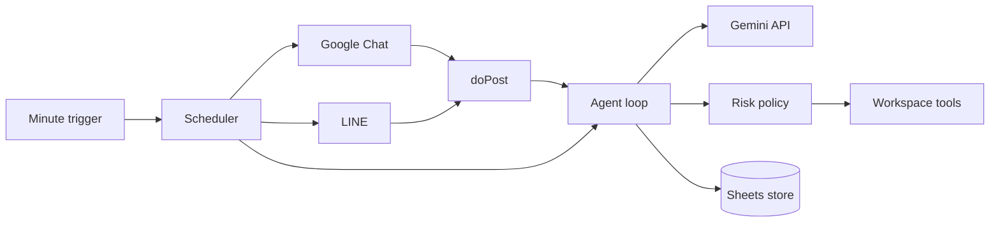

# Architecture

`gas-claw` is a single-owner, chat-first agent running entirely in Google Apps Script.

Messages are normalized before entering the agent. Model output is treated as a proposal: only registered tools can run, write/send actions pause for approval, and external document content cannot alter policy.

## Storage

- Script Properties: secrets and owner identifiers.
- Sheets: tasks, jobs, approvals, memory, and runs.
- CacheService: webhook deduplication.
- LockService: reserved for atomic repository updates.
- Drive/Docs: generated reports and long-form artifacts.

## LINE limitation

Apps Script web apps do not expose arbitrary request headers to `doPost(e)`, so direct deployment cannot verify LINE's `X-Line-Signature`. The pure-GAS edition uses an unguessable `LINE_WEBHOOK_TOKEN` query parameter plus an owner ID allowlist. Deploy a signature-verifying proxy in front of GAS if cryptographic source verification is required.
