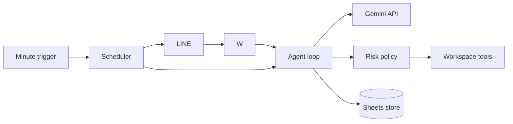

# Architecture

`gas-claw` is a single-owner, chat-first agent running entirely in Google Apps Script.

Messages are normalized before entering the agent. Model output is treated as a proposal: only registered tools can run, write/send actions pause for approval, and external document content cannot alter policy.

## Permission profiles

The default Core profile exposes LINE messaging plus deterministic tasks, memory and scheduling. Its manifest requests external requests, trigger management and Sheets only. Optional Workspace tools are absent from Gemini's declarations, so the model cannot call code the user did not authorize.

The Full profile uses `appsscript.full.json`, enables Google Tasks Advanced Service and adds Gmail, Calendar, Drive, Docs and Tasks scopes. `WORKSPACE_TOOLS_ENABLED=true` must also be set explicitly. Building a Full manifest without the feature flag leaves those tools unavailable; setting the flag while deploying Core causes tool calls to fail authorization rather than silently gaining access.

The scheduler holds `LockService` only while claiming at most ten due jobs. Claimed jobs enter `running` with a five-minute lease; Gemini calls and channel delivery happen after releasing the lock. A crashed execution is reclaimable after lease expiry, and its checkpointed delivery UUID prevents duplicate push messages.

## Workspace integration strategy

Version 1 calls Apps Script services and Google REST APIs directly. This keeps the personal deployment self-contained and preserves Google Tasks support.

Google Workspace remote MCP servers are an optional future tool adapter, not a runtime dependency. As of August 2026 they are in Developer Preview, require a Cloud project, OAuth clients and an external MCP client, and do not list Google Tasks among the supported products. The Agent loop, approval policy and scheduler are deliberately isolated from tool implementations so an MCP adapter can be added later without changing the conversational control plane.

Reference: <https://developers.google.com/workspace/guides/configure-mcp-servers>

## Storage

- Script Properties: secrets and owner identifiers.
- Sheets: tasks, jobs, approvals, memory, runs, and persistent webhook claims.
- CacheService: fast-path webhook deduplication and short sessions; correctness does not depend on cache retention.
- LockService: reserved for atomic repository updates.
- Drive/Docs: generated reports, long-form artifacts, and a private per-channel summary when a short session exceeds eight messages.

## LINE limitation

Apps Script web apps do not expose arbitrary request headers to `doPost(e)`, so direct deployment cannot verify LINE's `X-Line-Signature`. The pure-GAS edition uses an unguessable `LINE_WEBHOOK_TOKEN` query parameter plus an owner ID allowlist. Deploy a signature-verifying proxy in front of GAS if cryptographic source verification is required.
